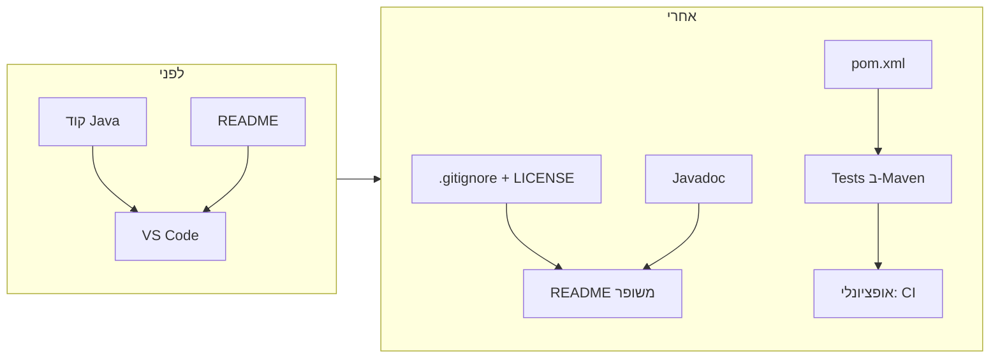

# תוכנית: הפיכת BavliManager לפרויקט תיק עבודות מקצועי

## מצב נוכחי (סיכום)

- **מבנה:** פרויקט Java עם חבילה אחת `bavli`, 11 מחלקות, כניסה ב-`[Main.java](src/bavli/Main.java)`, תפריט ב-`[SwitchCase.java](src/bavli/SwitchCase.java)`, וממשק גרפי ב-`[ExternalDisplay.java](src/bavli/ExternalDisplay.java)`.
- **בנייה:** רק דרך VS Code (אין Maven/Gradle). `[settings.json](.vscode/settings.json)` מגדיר `src`, `bin`, ו-`lib/**/*.jar`.
- **בדיקות:** `[Tests.java](src/bavli/Tests.java)` — מערך בדיקות ידני עם `assertTrue` וכו', לא JUnit.
- **תיעוד:** README דו-לשוני טוב; **חסרים:** קובץ `LICENSE`, `.gitignore`, Javadoc, ומדריך build ברור.

---

## 1. יסודות ריפו (חובה למראה מקצועי)


| פעולה                    | פרטים                                                                                                                                                                        |
| ------------------------ | ---------------------------------------------------------------------------------------------------------------------------------------------------------------------------- |
| **הוספת `.gitignore`**   | להתעלם מ-`bin/`, `*.class`, `.vscode/` (או רק חלק), `out/`, קבצי IDE (`.idea/`, `*.iml`), ולפי הצורך `lib/*.jar` או קבצי נתונים גדולים (למשל אם `bavli.txt` לא אמור להיכנס). |
| **הוספת קובץ `LICENSE`** | רישיון MIT כפי שמופיע ב-README (כולל שנה ושם המחבר).                                                                                                                         |


בלי אלה ריפו נראה לא גמור ולא מקצועי.

---

## 2. כלי בנייה (Maven מומלץ)

- **למה:** מעסיקים מצפים ל-`mvn compile` / `mvn test`; מאפשר CI והרצת בדיקות אוטומטית.
- **הצעה:** המרה ל-**Maven** (סטנדרט בתעשייה):
  - יצירת `pom.xml` עם: `groupId` (למשל `com.github.nafi052`), `artifactId` `BavliManager`, גרסת Java (למשל 11 או 17), ותלות ב-`lib/` דרך `system` scope עבור `itext-2.1.7.jar` (או העברה ל-Maven Central אם רוצים).
  - `sourceDirectory` = `src`, `outputDirectory` = `bin` (או עזיבת ברירת המחדל `target/`).
  - שמירת תאימות ל-VS Code: עדכון `.vscode/settings.json` כך ש-Java extension יזהה את הפרויקט כ-Maven (בדרך כלל אוטומטי אחרי הוספת `pom.xml`).

מבנה מוצע אחרי Maven:

```text
BavliManager/
  pom.xml
  .gitignore
  LICENSE
  README.md
  src/          → sourceRoot של Maven
  lib/
  user_notes/
  pages/        → נתונים (או הוראות ב-README איך ליצור)
```

---

## 3. בדיקות אוטומטיות

- **מצב:** `Tests.runAllTests()` מריץ בדיקות טובות אבל לא נחשב "test suite" סטנדרטי.
- **אפשרות א' (מינימלית):** ב-Maven להריץ את `Tests.runAllTests()` דרך Maven Exec Plugin (למשל ב-`verify`), כך ש-`mvn verify` יריץ את כל הבדיקות הקיימות. אם יש `System.exit` או חריגה — לתקן כך שהרצה תסומן ככישלון ב-CI.
- **אפשרות ב' (מקצועית יותר):** הוספת JUnit 5, העברת חלק מהבדיקות הקיימות ל-test classes ב-`src/test/java`, והשארת "סניטציה" או בדיקות אינטגרציה ב-`Tests.runAllTests()` עם Exec Plugin. כך מעסיק יראה גם `mvn test` וגם בדיקות מובנות.

המלצה: להתחיל באפשרות א' (הרצת `Tests.runAllTests()` ב-Maven) ורק אם רוצים להעמיק — להוסיף JUnit בהדרגה.

---

## 4. שיפור README ורושם ראשוני

- **קטע "Quick start":** הוספת פקודות ברורות, לדוגמה:
  - `mvn compile exec:java -Dexec.mainClass="bavli.Main"` (אחרי הוספת Maven)
  - או הוראות הרצה מ-VS Code (לחיצה על Run ב-Main).
- **דרישות:** רשימה מפורשת — JDK 11 (או 17), Maven 3.x, וקובץ `itext-2.1.7.jar` ב-`lib/` (עם לינק להורדה אם חוקי).
- **מבנה פרויקט:** לעדכן את התיאור כך שיתאים למבנה האמיתי (למשל אם `pages/` נוצר רק אחרי "פיצול קובץ" — לציין זאת).
- **תצוגה:** אם אפשר — צילום מסך אחד של הממשק הגרפי (או של התפריט בקונסול) כדי לתת רושם ויזואלי.
- **טכנולוגיות:** שורה קצרה — Java, Swing (GUI), מבנה חבילה יחיד וכו'.

אין צורך לשנות את המבנה הדו-לשוני; רק להשלים ולחדד.

---

## 5. תיעוד קוד (Javadoc)

- הוספת **Javadoc** למחלקות הציבוריות methods ציבוריים עיקריים (לפחות ב-Main, DataIndex, FileManager, SearchEngine, PersonalNotes, MishnaExtractor, HtmlExporter, CacheManager, SwitchCase, ExternalDisplay, Tests).
- אפשר לערבב עברית ואנגלית (למשל תיאור קצר בעברית + `@param`/`@return` באנגלית) או להשאיר אנגלית בלבד למעסיקים בינלאומיים.
- **אופציונלי:** קובץ `package-info.java` בחבילה `bavli` עם תיאור כללי של הפרויקט.

זה משדר מסודרות ומקצועיות.

---

## 6. שיפורי קוד (למראה מקצועי)

- **פורמט אחיד:** ריווח וסגנון עקביים (אם מוסיפים Maven — אפשר להוסיף plugin כמו `formatter-maven-plugin` או להשאיר ל-IDE).
- **ניקוי הערות:** ב-`[SwitchCase.java](src/bavli/SwitchCase.java)` יש הערות כפולות (למשל "// 1. טען דף מסוים" אחרי ה-println). להסיר כפילויות ולהשאיר הערות ברורות במקום אחד.
- **שמות:** שיקול לשינוי שם המחלקה `SwitchCase` ל-`MainMenu` או `MenuController` — שם תיאורי יותר ונפוץ בפרויקטים.
- **משתנים סטטיים:** ב-`DataIndex` יש `static final Map` — לוודא שאין בעיות thread-safety אם בעתיד ירצו גישה מקבילית (לפחות לתעד שמדובר ב-single-threaded).

לא חובה לעשות refactor גדול; די בשיפורים קלים שיראו טוב ב-diff.

---

## 7. אופציונלי: CI עם GitHub Actions

- אחרי ש-Maven ו-test run מוגדרים:
  - יצירת workflow ב-`.github/workflows/build.yml`: build על `push`/`pull_request` (למשל `mvn -B compile verify`).
  - הוספת badge ב-README: "Build passing" (או דומה).

זה נותן רושם של פרויקט מתוחזק ומוכן ל-contributions.

---

## 8. סדר ביצוע מומלץ

1. הוספת `.gitignore` ו-`LICENSE`.
2. יצירת `pom.xml` והרצת `mvn compile` ו-`mvn exec:java` (עם `exec-maven-plugin`) כדי לוודא שהאפליקציה עובדת.
3. חיבור `Tests.runAllTests()` ל-`mvn verify` (Exec Plugin).
4. עדכון README: Quick start, דרישות, מבנה, אופציונלי צילום מסך ו-badge.
5. הוספת Javadoc למחלקות ו-methods עיקריים.
6. ניקוי הערות וכפילויות ב-`SwitchCase` ובמקומות בולטים; אופציונלי שינוי שם `SwitchCase`.
7. אופציונלי: GitHub Actions + badge.

---

## דיאגרמה: מצב לפני ואחרי




---

## סיכום

- **חובה:** `.gitignore`, `LICENSE`, Maven (`pom.xml`), חיבור בדיקות ל-`mvn verify`, עדכון README עם Quick start ודרישות.
- **מומלץ:** Javadoc, ניקוי הערות וייתכן שינוי שם `SwitchCase`.
- **אופציונלי:** JUnit, GitHub Actions עם badge, צילום מסך ב-README.

אחרי יישום התוכנית, הריפו ייראה מסודר, ניתן לבנייה ולהרצת בדיקות בפקודה אחת, ותואם לציפיות של מעסיקים שבודקים פרויקטים ב-GitHub.